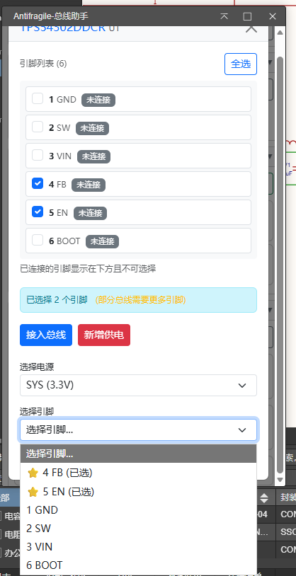

<<<<<<< HEAD
V26.3.30版本更新日志：

修复了若干问题，但问题不大，上一个版本也能用，我还更换了logo
=======
V26.3.25版本更新日志：

听取评论区网友建议，为新增电源的引脚选择列表中优先显示已选引脚，

>>>>>>> c9ca699f18add7943797687dc1374de43bceb87e

V26.3.16版本更新日志：

- 优化：将原生 confirm 对话框替换为 Bootstrap 样式模态框，提升 UI 一致性
- 新增：供电检查策略管理功能，支持配置需要检查供电的器件位号前缀规则（默认检查 U 开头器件）
- 优化：无供电提示现在只显示给匹配供电检查策略的器件，避免电容等无源器件显示不必要的提示

---

V26.3.10版本更新日志：

该版本为首次公开的版本。
